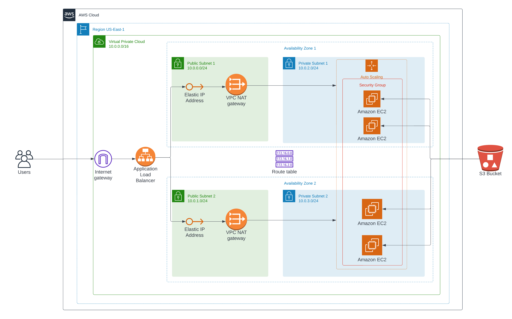

# Udagram App Project - Deploy a High-Availability Web App using CloudFormation 

> My name is Mohamed Magdy.
> In this project (Udagram App), I deployed web servers for a highly available web app using CloudFormation.



## The files included are:
```sh
* /Images of Deploy : Screenshot the result of deploy.
* /App of Udagram : Udagram App Code
* create.sh : Cloudformation create stack script. 
* update.sh : Cloudformation update stack script.
* destroy.sh : Cloudformation delete stack script.
* infrastructure_UdagramApp.yml : Udagram Project's CloudFormation script.
* infrastructure_UdagramApp.json : Udagram Project's CloudFormation script parameters.
```
## Instruction of deploy:

Just run;
```sh
> ./create.sh UdagramApp infrastructure_UdagramApp.yml infrastructure_UdagramApp.json
```
Result;
http://udagr-webap-uinx183xrpdg-1945377090.us-east-1.elb.amazonaws.com/
